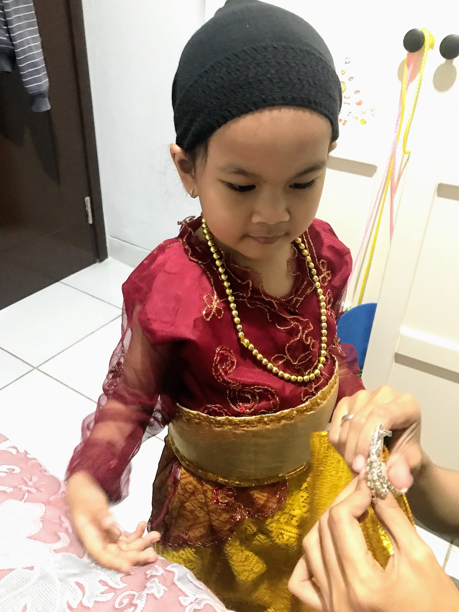
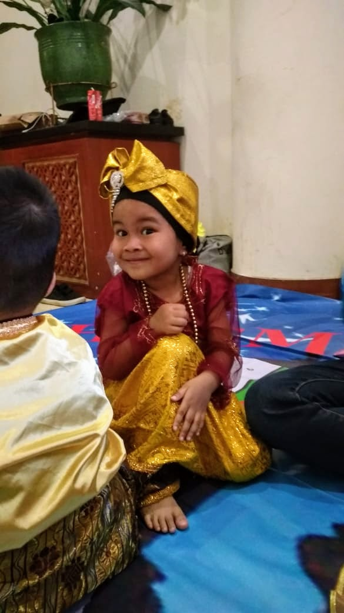

Saya termasuk introvert, begitu pula dengan istri saya. Dan kebetulan, anak kami pun masuk kategori introvert. Jadi, kami sangat excited dengan pertunjukan anak kami 🙂

Cerita ini dimulai ketika sekolah Anya akan mengadakan pentas pertunjukan yang terdiri dari murid dari TK sampai SMP. First of all, that’s a lot of children involved.

Beberapa kali anak saya menangis ketika latihan karena latihan dengan murid SMP. Wajar sih, bayangkan kita berumur 3 tahun dan latihan dengan anak umur 13-15thn yang badannya jauh lebih besar. Tapi Anya tetap semangat latihan 🙂

Pada hari H, kami bersiap-siap untuk berangkat ke gedung tempat pertunjukan berlangsung. Dan ketika istri memasangkan kostum ke Anya, dia menangis tidak mau datang ke pertunjukan..

Awalnya Anya ingin headband – nya dilepas. Kemudian lanjut ke sabuk, lanjut ingin lepas seluruh kostumnya. Istri saya memeluknya, dan kami memberikan semangat dengan meyakinkan kalau teman-teman Anya juga datang untuk perform. Setelah 15 menit, Anya sudah tenang dan mau berangkat.
Memakai kostum untuk pertunjukanPersiapan 😀

Setiba di gedung pertunjukan, kami menitipkan Anya kepada guru-gurunya. Kami pun masih deg-degan karena banyak terdengar tangis anak-anak.
Anya akan tampil di sini!

Di luar dugaan kami, Anya tampil penuh semangat dan ceria! Mungkin ini bukan hal besar untuk sebagian anak, tapi untuk Anya ini sangat challenging.
Anya di baris paling depan! 😀

<iframe width="560" height="315" src="https://www.youtube.com/embed/9oP-kFyur1w" frameborder="0" allow="accelerometer; autoplay; encrypted-media; gyroscope; picture-in-picture" allowfullscreen></iframe>

We’re so proud of you, because you conquered your fear, gave your best to do all this, for being so confident to perform with your friends. Great job! 💖

